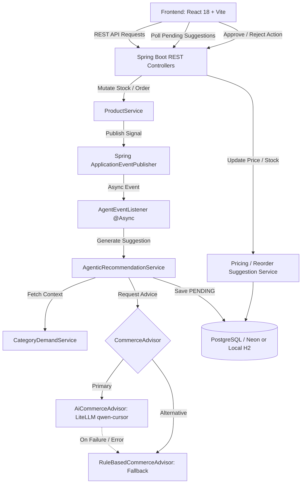

# StockPulse — AI Inventory & Dynamic Pricing Engine

StockPulse is an intelligent merchandising and inventory intelligence engine that automates the detection of supply-demand imbalances, generates dynamic pricing and replenishment recommendations, and enforces a strict human-in-the-loop approval checkpoint before applying changes to production inventory.

---

## The Problem

Modern e-commerce and retail merchandising face critical operational challenges:
- **Manually Managed Pricing**: Pricing adjustments are slow, reactive, and often misaligned with real-time inventory fluctuations.
- **Real-Time Inventory Volatility**: Fast-moving stock, supply delays, and localized demand shifts require immediate reaction to avoid costly stockouts or margin erosion.
- **Demand Spikes & Low Stock Surges**: Sudden sales surges drain inventory before replenishment orders can be manually placed, leading to lost revenue and suboptimal price realization.
- **The StockPulse Solution**: StockPulse continuously monitors inventory and order velocity signals. When anomalies occur (e.g. low stock or demand surges), it orchestrates context gathering, computes AI or rule-based price and reorder recommendations, and stages them for merchandising approval.

---

## What the System Does

StockPulse operates on a clear, decoupled decision-and-control loop:

```
[Signal] ─────────► [Context Aggregation] ───► [Commerce Advisor]
(Stock / Order)      (Stock, Threshold,          (AI or Deterministic)
                      Velocity, Category Avg)            │
                                                         ▼
[Product State Update] ◄── [Human Approval] ◄── [Staged Recommendations]
(Price / Stock applied)     (Accept / Reject)   (Pricing & Reorder: PENDING)
```

### Core Execution Flow
1. **Signal Ingestion**: Stock changes (`PATCH /products/{id}/stock`) or order sales (`POST /products/{id}/orders`) trigger real-time evaluation.
2. **Event Detection**:
   - **Inventory-Low Trigger**: Fired when `stockLevel < reorderThreshold`.
   - **Demand-Spike Trigger**: Fired when `demandVelocity > categoryAverageDemandVelocity × spikeMultiplier` (default 3.0×).
3. **Asynchronous Recommendation Generation**: Decoupled from the HTTP request thread via Spring `@Async` events. Suggestions are calculated in the background without blocking the user.
4. **AI + Deterministic Fallback**: The active `CommerceAdvisor` evaluates the product context. If the AI model (LiteLLM / `qwen-cursor`) fails, times out, or returns out-of-bounds numbers, the engine instantly falls back to the deterministic `RuleBasedCommerceAdvisor`.
5. **Human Checkpoint**: Generated recommendations are persisted in a `PENDING` state. Nothing updates live prices or stock levels without explicit human approval.
6. **Product State Update**: Once an operator accepts a suggestion, the product price is updated (`currentPrice`) or replenished stock is incremented (`stockLevel`).

---

## Architecture

StockPulse is designed with a clean, decoupled architecture:
- **Frontend**: Single-page merchandising dashboard built in React 18, TypeScript, and Vite. Interacts with the backend via centralized REST API utilities and short-polling for asynchronous agent outputs.
- **Backend API Layer**: Spring Boot REST controllers exposing endpoints for products, orders, stock adjustments, and recommendation approval workflows.
- **Agentic Event Bus**: Spring `ApplicationEventPublisher` publishing lightweight domain events (`InventoryLowEvent`, `DemandSpikeEvent`) handled asynchronously by `AgentEventListener` on a dedicated thread pool.
- **Commerce Strategy Layer**: Strategy pattern with a unified `CommerceAdvisor` interface backed by `AiCommerceAdvisor` (Zycus LiteLLM proxy calling `qwen-cursor`) and `RuleBasedCommerceAdvisor` (deterministic rules engine).
- **Data Persistence**: Spring Data JPA / Hibernate supporting Neon PostgreSQL for production environments and an in-memory H2 database for zero-dependency local development and evaluation.



---

## Core Technologies

| Component | Technology | Version / Details |
|-----------|------------|-------------------|
| **Backend Framework** | Spring Boot | `3.1.5` |
| **Language** | Java | `17+` (compatible with Java 17 and Java 21) |
| **Build Tool** | Apache Maven | `3.9+` |
| **Persistence** | Spring Data JPA / Hibernate | Object-Relational Mapping & Transactions |
| **Production Database** | PostgreSQL / Neon | Cloud serverless PostgreSQL with SSL |
| **Local Database** | H2 Database | In-memory profile (`-Dspring-boot.run.profiles=local`) |
| **Frontend Framework** | React | `18.3.1` |
| **Frontend Language** | TypeScript | `5.6.2` |
| **Build & Bundler** | Vite | `5.4.14` |
| **Styling** | Vanilla CSS | Custom design tokens, dark theme, responsive grid |
| **AI LLM Gateway** | LiteLLM | Model `qwen-cursor` with structured JSON responses |
| **JSON Serialization** | Jackson Databind | Clean JSON schema mapping and validation |

---

## Business Logic Overview

### Deterministic Rule Engine (`RuleBasedCommerceAdvisor`)
When running under the `RULE_BASED` strategy, or whenever the AI advisor triggers its fallback mechanism, recommendations follow exact deterministic formulas:

#### Dynamic Pricing Rules
1. **Low Stock Condition** (`stockLevel < reorderThreshold`):
   - **Action**: Price increased by **+10%** (`currentPrice × 1.10`)
   - **Direction**: `INCREASE`
   - **Confidence**: `0.9`
   - **Reasoning**: Protects remaining scarce inventory and moderates depletion rate.
2. **Demand Spike Condition** (`demandVelocity > 2 × categoryAverageDemandVelocity`):
   - **Action**: Price increased by **+5%** (`currentPrice × 1.05`)
   - **Direction**: `INCREASE`
   - **Confidence**: `0.8`
   - **Reasoning**: Modest price adjustment capitalizing on elevated demand velocity while balancing supply.
3. **Normal / Stable Condition**:
   - **Action**: Price held unchanged (`currentPrice`)
   - **Direction**: `HOLD`
   - **Confidence**: `0.7`
   - **Reasoning**: Stable demand and adequate stock levels; no price adjustment needed.

#### Reorder Quantity Formula
$$\text{Recommended Quantity} = \max(1, (\text{reorderThreshold} \times 3) - \text{currentStock})$$
- **Lead Time**: 7 days
- **Confidence**: `0.85`

### AI Commerce Advisor (`AiCommerceAdvisor`)
When the `AI` strategy is enabled:
- Constructs rich prompts detailing product name, category, current price, stock levels, threshold, demand velocity, and category average demand.
- Solicits structured JSON recommendations from `qwen-cursor` with natural language merchandising reasoning.
- Validates that recommended prices remain within reasonable bounds (50% to 150% of current price).
- If validation fails, or if network/API errors occur, it seamlessly falls back to `RuleBasedCommerceAdvisor` without interrupting service.

---

## Agentic Loop & Idempotency

The autonomous agent loop guarantees timely recommendations while protecting against redundant executions:

```
Stock Mutation / Sale Simulation
             │
             ▼
Check threshold & spike condition
             │
             ▼
Publish InventoryLowEvent or DemandSpikeEvent
             │
             ▼
AgentEventListener (@Async, Async-Executor thread pool)
             │
             ▼
Deduplication Check:
Is there already a PENDING suggestion for this Product + TriggerReason?
     ├── YES ──► Log duplicate & exit gracefully (Idempotent)
     └── NO  ──► Generate Context ──► CommerceAdvisor ──► Save PENDING Suggestions
```

- **Asynchronous Execution**: Handled via Spring's `ThreadPoolTaskExecutor` (`corePoolSize=4`, `maxPoolSize=10`, `queueCapacity=100`).
- **Idempotency**: `AgenticRecommendationService` checks for existing `PENDING` suggestions with the matching `TriggerReason`. Repeated orders will not flood the merchandiser with duplicate suggestion cards.

---

## Evaluator Quick Walkthrough (Demo Flow)

Follow these steps for a complete end-to-end evaluation:

### Step 1: Start Backend
```powershell
cd backend
mvn spring-boot:run "-Dspring-boot.run.profiles=local"
```
Wait until the console reports: `Started StockPulseApplication in ... seconds`.

### Step 2: Start Frontend
In a separate terminal:
```powershell
cd frontend
npm install
npm run dev
```
Open your browser at `http://localhost:5173`.

### Step 3: Run the Inventory-Low Demo (`PRD-003`)
1. On the dashboard, locate seeded product **PRD-003** (*Organic Cotton T-Shirt*).
2. Note that its stock level is `8` with a threshold of `15`.
3. In the input box next to "Set Stock", enter `5` and click **Set Stock** (or click **🛒 Simulate Sale**).
4. Within 2–4 seconds, the asynchronous agent detects low inventory and creates:
   - **💡 Pricing Suggestion**: Recommends increasing the price by +10% (from $24.99 to $27.49) with trigger `INVENTORY_LOW`.
   - **📦 Reorder Suggestion**: Recommends replenishment quantity (`+37` units).
5. Click **Accept** on the pricing suggestion.
6. Observe that the product's live price instantly updates to **$27.49** and the card badge updates.

### Step 4: Run the Demand-Spike Demo (`PRD-008`)
1. Locate seeded product **PRD-008** (*Hoodie - Heather Grey*).
2. Its current demand velocity is high (`15.0/day`), and stock is `11` (threshold `12`).
3. Click **🛒 Simulate Sale**.
4. The sale decrements stock and increments demand velocity to `16.0/day`, triggering both low inventory and a demand spike relative to the apparel category average.
5. Watch the asynchronous agent stage new pending suggestions with full reasoning.
6. Accept or Reject either suggestion and verify the immediate dashboard update.

---

## Setup & Running Instructions

### Prerequisites
- **Java**: JDK 17 or JDK 21 installed (`java -version` and `javac -version`)
- **Maven**: Maven 3.9+ (`mvn -version`)
- **Node.js**: Node 18+ and npm (`node -v` and `npm -v`)

---

### Backend Setup

#### Option A: Local In-Memory H2 Profile (Recommended for Evaluation)
Requires no external database setup. The application automatically starts with an embedded H2 database and seeds all 8 demo products:
```powershell
cd backend
mvn spring-boot:run "-Dspring-boot.run.profiles=local"
```
H2 console is accessible at `http://localhost:8080/h2-console` (JDBC URL: `jdbc:h2:mem:stockpulse`, user: `sa`, password: empty).

#### Option B: Production Neon PostgreSQL Configuration
Configure your `.env` file in `/backend/.env`:
```env
DATABASE_URL=jdbc:postgresql://<neon-host>:5432/<database>?user=<user>&password=<password>&sslmode=require
LLM_PROVIDER=litellm
LLM_BASE_URL=https://litellm-qc.zycus.net
LLM_API_KEY=<your-api-key>
LLM_MODEL=qwen-cursor
```
Run with default profile:
```powershell
cd backend
mvn spring-boot:run
```

---

### Frontend Setup

```powershell
cd frontend
npm install
npm run dev
```
The dashboard runs at `http://localhost:5173` and connects to the backend at `http://localhost:8080`.

To build the production bundle:
```powershell
cd frontend
npm run build
```

---

## Project Structure

```
zycus-hackathon/
├── README.md                      # Root documentation & architecture overview
├── backend/                       # Spring Boot 3.1.5 backend service
│   ├── pom.xml                    # Maven build configuration & dependencies
│   ├── ADR.md                     # Architecture Decision Records (ADR-001 - ADR-006)
│   ├── .env.example               # Example environment variable template
│   ├── src/
│   │   ├── main/
│   │   │   ├── java/com/stockpulse/
│   │   │   │   ├── agent/         # Event bus, @Async listeners, AgenticRecommendationService
│   │   │   │   ├── ai/            # LiteLLM client (qwen-cursor), MockLlmClient, LlmClient interface
│   │   │   │   ├── commerce/      # CommerceAdvisor strategy, RuleBased & AI implementations, Category analytics
│   │   │   │   ├── common/        # GlobalExceptionHandler, HealthController, Enums
│   │   │   │   ├── config/        # ThreadPool AsyncConfig, CorsConfig, StrategyConfig
│   │   │   │   ├── pricing/       # PricingSuggestion entity, repository, service, controller
│   │   │   │   ├── product/       # Product entity, repository, service, controller
│   │   │   │   ├── reorder/       # ReorderSuggestion entity, repository, service, controller
│   │   │   │   └── seed/          # SeedDataLoader initializing the 8 demo catalog products
│   │   │   └── resources/
│   │   │       ├── application.yml        # Default production / PostgreSQL configuration
│   │   │       └── application-local.yml  # Local H2 development profile
│   │   └── test/                  # 16 unit and integration test suites
└── frontend/                      # React 18 + TypeScript + Vite merchandising dashboard
    ├── package.json               # Frontend dependencies & scripts
    ├── vite.config.ts             # Vite configuration
    ├── src/
    │   ├── App.tsx                # Single-page dashboard, state, card grid, polling loop
    │   ├── api.ts                 # Centralized REST API fetch utilities
    │   ├── types.ts               # TypeScript interfaces for Product, Suggestions
    │   ├── index.css              # Custom styling, dark mode design system, badges
    │   └── main.tsx               # Application root bootstrap
```

---

## Detailed Documentation Links

- **Backend Deep Dive**: [backend/README.md](file:///c:/Users/poweroot/Desktop/zycus-hackathon/zycus-hackathon/backend/README.md)
- **Frontend Deep Dive**: [frontend/README.md](file:///c:/Users/poweroot/Desktop/zycus-hackathon/zycus-hackathon/frontend/README.md)
- **Architecture Decision Records**: [backend/ADR.md](file:///c:/Users/poweroot/Desktop/zycus-hackathon/zycus-hackathon/backend/ADR.md)
