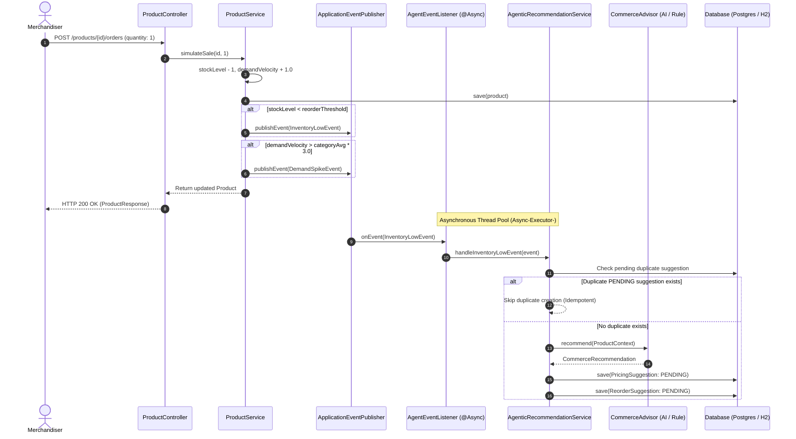

# StockPulse Backend — Technical Documentation

The StockPulse backend is a Spring Boot service responsible for real-time inventory management, asynchronous agentic signal processing, intelligent dynamic pricing and reorder calculations, and human-supervised recommendation lifecycle management.

---

## Technology Stack

The backend is built with modern Java enterprise technologies:

- **Framework**: Spring Boot `3.1.5`
- **Language**: Java `17+` (Verified on Java 17 and Java 21)
- **Build & Dependency Management**: Apache Maven `3.9+`
- **Data Persistence**: Spring Data JPA & Hibernate `6.2.x`
- **Production Database**: PostgreSQL (Serverless Neon PostgreSQL via JDBC driver `org.postgresql.Driver`)
- **Local Development Database**: H2 Database (`com.h2database:h2`, in-memory profile)
- **JSON Serialization**: Jackson Databind `2.15.x`
- **Asynchronous Execution**: Spring Events (`ApplicationEventPublisher`, `@EventListener`, `@Async`, `ThreadPoolTaskExecutor`)
- **AI Gateway Integration**: Zycus LiteLLM Proxy via Spring `RestTemplate` (Model: `qwen-cursor`)
- **Code Generation**: Project Lombok
- **Testing**: JUnit 5, Mockito, Spring Boot Test (`spring-boot-starter-test`)

---

## Project Structure

The codebase is organized into domain-driven packages under `src/main/java/com/stockpulse`:

```
backend/
├── pom.xml                                      # Maven build configuration
├── ADR.md                                       # Architecture Decision Records (ADR-001 - ADR-006)
├── .env.example                                 # Template for environment variables
├── src/main/java/com/stockpulse/
│   ├── StockPulseApplication.java               # Main Spring Boot entrypoint
│   ├── agent/                                   # Asynchronous Agentic Loop
│   │   ├── InventoryLowEvent.java               # Low stock signal event
│   │   ├── DemandSpikeEvent.java                # Demand spike signal event
│   │   ├── AgentEventListener.java              # @Async event listeners
│   │   └── AgenticRecommendationService.java    # Orchestrates suggestions with idempotency
│   ├── ai/                                      # LLM Integration Layer
│   │   ├── LlmClient.java                       # Unified LLM interface
│   │   ├── LiteLlmClient.java                   # Real Zycus LiteLLM client (qwen-cursor)
│   │   └── MockLlmClient.java                   # Fallback mock LLM for testing
│   ├── commerce/                                # Merchandising Strategy & Calculation
│   │   ├── CommerceAdvisor.java                 # Strategy interface
│   │   ├── RuleBasedCommerceAdvisor.java        # Deterministic formula engine
│   │   ├── AiCommerceAdvisor.java               # LLM prompt, parser, validator & fallback
│   │   ├── CategoryDemandService.java           # Category-wide demand velocity analytics
│   │   ├── ProductContext.java                  # Aggregated product & market context DTO
│   │   └── CommerceRecommendation.java          # Advisor calculation result DTO
│   ├── common/                                  # Shared Infrastructure & Utilities
│   │   ├── GlobalExceptionHandler.java          # REST exception handler (@RestControllerAdvice)
│   │   ├── HealthController.java                # Service & database health endpoint
│   │   ├── SuggestionStatus.java                # PENDING, ACCEPTED, REJECTED
│   │   └── TriggerReason.java                   # INITIAL, INVENTORY_LOW, DEMAND_SPIKE, MANUAL
│   ├── config/                                  # Spring Configuration Beans
│   │   ├── AsyncConfig.java                     # Custom ThreadPoolTaskExecutor configuration
│   │   ├── CorsConfig.java                      # Cross-Origin configuration (ports 5173, 4200)
│   │   └── StrategyConfig.java                  # CommerceAdvisor bean selection (AI vs Rule)
│   ├── pricing/                                 # Pricing Domain
│   │   ├── Direction.java                       # INCREASE, DECREASE, HOLD
│   │   ├── PricingSuggestion.java               # JPA Entity for pricing recommendations
│   │   ├── PricingSuggestionRepository.java     # Data access layer
│   │   ├── PricingSuggestionService.java        # Status transitions & price mutations
│   │   ├── PricingSuggestionController.java     # REST API controller
│   │   └── dto/                                 # Request and Response DTOs
│   ├── product/                                 # Product Catalog Domain
│   │   ├── Category.java                        # ELECTRONICS, APPAREL, HOME
│   │   ├── Status.java                          # ACTIVE, PRICE_REVIEW_PENDING, OUT_OF_STOCK
│   │   ├── Product.java                         # JPA Entity for inventory catalog
│   │   ├── ProductRepository.java               # Data access layer
│   │   ├── ProductService.java                  # Product business logic, sales & events
│   │   ├── ProductController.java               # REST API controller
│   │   ├── ProductNotFoundException.java        # Custom 404 domain exception
│   │   └── dto/                                 # Request and Response DTOs
│   ├── reorder/                                 # Replenishment Domain
│   │   ├── ReorderSuggestion.java               # JPA Entity for reorder recommendations
│   │   ├── ReorderSuggestionRepository.java     # Data access layer
│   │   ├── ReorderSuggestionService.java        # Status transitions & stock replenishments
│   │   ├── ReorderSuggestionController.java     # REST API controller
│   │   └── dto/                                 # Request and Response DTOs
│   └── seed/                                    # Catalog Seeding
│       └── SeedDataLoader.java                  # Initializes 8 catalog items on startup
└── src/main/resources/
    ├── application.yml                          # Production / Neon PostgreSQL config
    └── application-local.yml                    # Local H2 in-memory profile config
```

---

## Domain Model

### 1. Product (`com.stockpulse.product.Product`)
Represents an item in the merchandise catalog.
- **Fields**:
  - `id`: `Long` (Primary Key, Identity)
  - `sku`: `String` (Unique, required)
  - `name`: `String` (Required)
  - `category`: `Category` enum (`ELECTRONICS`, `APPAREL`, `HOME`)
  - `currentPrice`: `BigDecimal` (Positive, current selling price)
  - `stockLevel`: `Integer` (Zero or positive, current available inventory)
  - `reorderThreshold`: `Integer` (Zero or positive, inventory alarm limit)
  - `demandVelocity`: `Double` (Units sold per day rate)
  - `status`: `Status` enum (`ACTIVE`, `PRICE_REVIEW_PENDING`, `OUT_OF_STOCK`)
  - `createdAt`: `LocalDateTime` (Immutable timestamp)
  - `updatedAt`: `LocalDateTime` (Updated on modification)
- **Lifecycle Hooks**:
  - `@PrePersist` and `@PreUpdate`: Sets timestamps and executes `updateStatusBasedOnStock()`. If `stockLevel == 0`, status is automatically updated to `Status.OUT_OF_STOCK`.

### 2. PricingSuggestion (`com.stockpulse.pricing.PricingSuggestion`)
Represents an actionable recommendation to adjust product price.
- **Fields**:
  - `id`: `Long` (Primary Key, Identity)
  - `product`: `Product` (`@ManyToOne(fetch = FetchType.LAZY)`)
  - `currentPrice`: `BigDecimal` (Snapshot price at recommendation time)
  - `recommendedPrice`: `BigDecimal` (Suggested target price)
  - `direction`: `Direction` enum (`INCREASE`, `DECREASE`, `HOLD`)
  - `confidence`: `Double` (Confidence score between 0.0 and 1.0)
  - `reasoning`: `String` (Up to 1,000 chars of natural language justification)
  - `status`: `SuggestionStatus` enum (Default: `PENDING`)
  - `triggerReason`: `TriggerReason` enum (`INITIAL`, `INVENTORY_LOW`, `DEMAND_SPIKE`, `MANUAL`)
  - `createdAt` / `updatedAt`: `LocalDateTime`

### 3. ReorderSuggestion (`com.stockpulse.reorder.ReorderSuggestion`)
Represents an actionable recommendation to order replenishment stock.
- **Fields**:
  - `id`: `Long` (Primary Key, Identity)
  - `product`: `Product` (`@ManyToOne(fetch = FetchType.LAZY)`)
  - `currentStock`: `Integer` (Snapshot stock at recommendation time)
  - `recommendedQuantity`: `Integer` (Suggested reorder units)
  - `suggestedLeadTimeDays`: `Integer` (Expected delivery lead time)
  - `confidence`: `Double` (Confidence score between 0.0 and 1.0)
  - `reasoning`: `String` (Up to 1,000 chars justification)
  - `status`: `SuggestionStatus` enum (Default: `PENDING`)
  - `triggerReason`: `TriggerReason` enum
  - `createdAt` / `updatedAt`: `LocalDateTime`

### State Transitions
Both suggestion types follow a strict one-way state transition:
$$\text{PENDING} \longrightarrow \begin{cases} \text{ACCEPTED} \\ \text{REJECTED} \end{cases}$$
- Transitions out of `ACCEPTED` or `REJECTED` throw `IllegalStateException` ("Cannot change status from ACCEPTED to ...").
- Passing any status other than `ACCEPTED` or `REJECTED` throws `IllegalArgumentException`.

---

## Business Logic

### Deterministic Pricing Rules (`RuleBasedCommerceAdvisor`)
1. **Low Stock Rule**:
   - Condition: `context.getCurrentStock() < context.getReorderThreshold()`
   - Price adjustment: `currentPrice × 1.10` (+10% increase)
   - Direction: `Direction.INCREASE`
   - Confidence: `0.9`
   - Reasoning: *"Low stock detected. Increasing price by 10% to protect remaining inventory and potentially reduce demand."*
2. **Demand Spike Rule**:
   - Condition: `context.getDemandVelocity() > 2 × context.getCategoryAverageDemandVelocity()`
   - Price adjustment: `currentPrice × 1.05` (+5% increase)
   - Direction: `Direction.INCREASE`
   - Confidence: `0.8`
   - Reasoning: *"High demand velocity detected (more than 2x category average). Modest price increase to balance supply and demand."*
3. **Hold Current Price Rule**:
   - Condition: Neither condition met
   - Price adjustment: `currentPrice` (No change)
   - Direction: `Direction.HOLD`
   - Confidence: `0.7`
   - Reasoning: *"Stable demand and adequate stock levels. No price adjustment recommended."*

### Reorder Formula
$$\text{recommendedQuantity} = \max(1, (\text{reorderThreshold} \times 3) - \text{currentStock})$$
- Default lead time: **7 days**
- Confidence: `0.85`
- Reasoning: *"Calculated reorder quantity based on triple the reorder threshold minus current stock."*

### Category Average Demand Analytics (`CategoryDemandService`)
- Dynamically queries all products matching `product.getCategory()`.
- Computes: $\frac{\sum \text{demandVelocity}}{N_{\text{category}}}$.
- If no products exist in the category, returns `0.0`.

### Demand Spike Threshold
Configured in `application.yml` via `stockpulse.demand.spikeMultiplier` (default: `3.0`).
When a sale is simulated (`simulateSale`), a `DemandSpikeEvent` is triggered if:
$$\text{updatedProduct.getDemandVelocity()} > \text{categoryAverage} \times \text{demandSpikeMultiplier}$$

---

## AI Advisor (`AiCommerceAdvisor`)

The AI Advisor uses Zycus LiteLLM to provide intelligent merchandising context while enforcing strict validation and automatic fallback.

### Integration Details
- **HTTP Client**: `LiteLlmClient` uses Spring `RestTemplate` (active when `llm.provider=litellm`).
- **Endpoint**: `${llm.base.url}/v1/chat/completions` (e.g. `https://litellm-qc.zycus.net/v1/chat/completions`).
- **Authentication**: `Authorization: Bearer ${llm.api.key}`.
- **Required Header**: `product: PC1`.
- **Model**: `qwen-cursor` (configured via `${llm.model}`).
- **Temperature**: `0.1` (deterministic, structured output).

### Request Payload Structure
```json
{
  "model": "qwen-cursor",
  "temperature": 0.1,
  "messages": [
    {
      "role": "user",
      "content": "You are an AI Commerce Advisor for StockPulse. Trigger: INVENTORY_LOW. Product Name: Organic Cotton T-Shirt. Category: APPAREL. Current Price: 24.99. Current Stock: 8. Reorder Threshold: 15. Demand Velocity (per day): 12.00. Category Average Demand: 8.50. Merchandising tradeoff: You need to decide whether to protect scarce inventory with a price increase OR use a discount/clearance approach if the product is stale. Provide a JSON response with the following keys: recommendedPrice, direction (INCREASE, DECREASE, HOLD), confidence, pricingReasoning, recommendedQuantity, reorderConfidence, reorderReasoning, suggestedLeadTimeDays."
    }
  ]
}
```

### Response Parsing & Markdown Sanitization
The advisor strips any surrounding markdown code fences (```json ... ```) and parses the clean string with Jackson's `ObjectMapper`.

### Validation Guardrails
Before accepting the recommendation, `validateRecommendation()` enforces:
1. `recommendedPrice > 0`
2. **Bounding Rule**: `recommendedPrice` must be between **50% and 150%** of `currentPrice` (`currentPrice * 0.5 <= price <= currentPrice * 1.5`).
3. `0.0 <= priceConfidence <= 1.0`
4. `recommendedQuantity > 0`
5. `priceReasoning` must not be null or blank.

### Automatic Fallback
If the LLM client throws a connection error, returns invalid JSON, or fails validation, `AiCommerceAdvisor` logs the error and delegates directly to `RuleBasedCommerceAdvisor.recommend(context)`.

---

## Agentic Loop & Event Architecture

The agentic loop processes inventory signals asynchronously without blocking API responses:



### Thread Pool Configuration (`AsyncConfig`)
Spring's `@Async` execution uses a custom `ThreadPoolTaskExecutor`:
- **Core Pool Size**: `4`
- **Max Pool Size**: `10`
- **Queue Capacity**: `100`
- **Thread Prefix**: `Async-Executor-`

### Idempotency & Deduplication
To prevent duplicate suggestions when multiple orders are processed in rapid succession:
- `pricingSuggestionRepository.findByProductIdAndTriggerReasonAndStatus(id, trigger, PENDING)`
- `reorderSuggestionRepository.findByProductIdAndTriggerReasonAndStatus(id, trigger, PENDING)`
If a pending suggestion already exists for that product and trigger reason, the background agent logs the event and terminates gracefully.

---

## API Reference

All endpoints are registered under port `8080`.

| Method | Path | Purpose | Request Body | Response Status & Key Fields | Side Effects |
|--------|------|---------|--------------|------------------------------|--------------|
| `GET` | `/health` | Liveness & database probe | None | `200 OK`<br>`{"status": "UP", "database": "UP"}` | None |
| `POST` | `/products` | Create catalog item | `ProductCreateRequest` (`sku`, `name`, `category`, `currentPrice`, `stockLevel`, `reorderThreshold`, `demandVelocity`) | `201 Created`<br>`ProductResponse` | Persists new product |
| `GET` | `/products` | List all products (optional filter by `status`, `category`) | Query params: `?status=...&category=...` | `200 OK`<br>`List<ProductResponse>` | None |
| `PATCH` | `/products/{id}/stock` | Update inventory stock level | `{"stockLevel": 10}` | `200 OK`<br>`ProductResponse` | Updates stock. Publishes `InventoryLowEvent` if `stockLevel < reorderThreshold`. |
| `POST` | `/products/{id}/orders` | Simulate a sale | `{"quantity": 1}` | `200 OK`<br>`ProductResponse` | Decrements stock, increments `demandVelocity` by 1.0. May publish `InventoryLowEvent` and `DemandSpikeEvent`. |
| `POST` | `/pricing-suggestions/products/{id}/suggest-pricing` | Generate manual pricing suggestion | None | `200 OK`<br>`PricingSuggestionResponse` | Invokes advisor with `MANUAL` trigger; saves suggestion with status `PENDING`. |
| `GET` | `/pricing-suggestions/products/{id}` | Get pricing suggestions for product | None | `200 OK`<br>`List<PricingSuggestionResponse>` | None (ordered by `createdAt DESC`) |
| `PATCH` | `/pricing-suggestions/{id}` | Approve or reject pricing suggestion | `{"status": "ACCEPTED" \| "REJECTED"}` | `200 OK`<br>`PricingSuggestionResponse` | If `ACCEPTED`, sets `Product.currentPrice` to `recommendedPrice` and resets status to `ACTIVE`. |
| `POST` | `/reorder-suggestions/products/{id}/suggest-reorder` | Generate manual reorder suggestion | None | `200 OK`<br>`ReorderSuggestionResponse` | Invokes advisor with `MANUAL` trigger; saves suggestion with status `PENDING`. |
| `GET` | `/reorder-suggestions/products/{id}` | Get reorder suggestions for product | None | `200 OK`<br>`List<ReorderSuggestionResponse>` | None (ordered by `createdAt DESC`) |
| `PATCH` | `/reorder-suggestions/{id}` | Approve or reject reorder suggestion | `{"status": "ACCEPTED" \| "REJECTED"}` | `200 OK`<br>`ReorderSuggestionResponse` | If `ACCEPTED`, adds `recommendedQuantity` to `Product.stockLevel` and resets status to `ACTIVE`. |

 | `GET` | `/config/commerce-strategy` | Get current active commerce strategy | None | `200 OK`<br>`{"strategy": "RULE_BASED"}` | None |
 | `PUT` | `/config/commerce-strategy` | Switch active commerce strategy at runtime | `{"strategy": "AI"}` or `{"strategy": "RULE_BASED"}` | `200 OK`<br>`{"strategy": "AI"}` | Changes the advisor strategy used for subsequent recommendations. |

 ---
---

## Human Approval Workflow

The approval workflow enforces human supervision over all AI and rule recommendations:

### Pricing Approval Flow
- User submits `PATCH /pricing-suggestions/{id}` with `{"status": "ACCEPTED"}`.
- `PricingSuggestionService` verifies that the current status is `PENDING`.
- Status is updated to `ACCEPTED`.
- The target product's `currentPrice` is updated to `suggestion.getRecommendedPrice()`.
- The product's `status` is reset to `Status.ACTIVE`.

### Reorder Approval Flow
- User submits `PATCH /reorder-suggestions/{id}` with `{"status": "ACCEPTED"}`.
- `ReorderSuggestionService` verifies that the current status is `PENDING`.
- Status is updated to `ACCEPTED`.
- The target product's `stockLevel` is incremented by `suggestion.getRecommendedQuantity()`.
- The product's `status` is reset to `Status.ACTIVE`.

If rejected (`{"status": "REJECTED"}`), the suggestion status changes to `REJECTED`, and no product attributes are modified.

---

## Seed Data Catalog

The application automatically seeds 8 demo products on startup via `SeedDataLoader`:

| SKU | Name | Category | Price | Stock | Threshold | Demand Velocity | Initial Status | Intended Demo Purpose |
|-----|------|----------|-------|-------|-----------|-----------------|----------------|-----------------------|
| `PRD-001` | Wireless Earbuds Pro | `ELECTRONICS` | $79.99 | 45 | 20 | 3.0/day | `ACTIVE` | Standard baseline product |
| `PRD-002` | USB-C Hub 7-Port | `ELECTRONICS` | $34.99 | 120 | 30 | 1.0/day | `ACTIVE` | Overstocked / high supply |
| `PRD-003` | Organic Cotton T-Shirt | `APPAREL` | $24.99 | 8 | 15 | 12.0/day | `PRICE_REVIEW_PENDING` | **Inventory-Low Demo Target** (Stock 8 < Threshold 15) |
| `PRD-004` | Running Shorts - Navy | `APPAREL` | $39.99 | 55 | 20 | 2.0/day | `ACTIVE` | Apparel category baseline |
| `PRD-005` | Ceramic Pour-Over Set | `HOME` | $49.99 | 22 | 10 | 4.0/day | `ACTIVE` | Home goods baseline |
| `PRD-006` | LED Desk Lamp - Dimmable | `HOME` | $59.99 | 0 | 15 | 0.0/day | `OUT_OF_STOCK` | Zero-stock indicator verification |
| `PRD-007` | Portable Charger 20K | `ELECTRONICS` | $44.99 | 18 | 25 | 8.0/day | `ACTIVE` | Low stock candidate |
| `PRD-008` | Hoodie - Heather Grey | `APPAREL` | $54.99 | 11 | 12 | 15.0/day | `ACTIVE` | **Demand-Spike Demo Target** (Velocity 15.0 vs cat avg ~9.6) |

---

## Configuration & Environment Variables

StockPulse uses Spring environment configuration. Never commit production secrets.

| Variable | Default Value | Description |
|----------|---------------|-------------|
| `DATABASE_URL` | None | Full JDBC PostgreSQL connection string including credentials and SSL mode. Example: `jdbc:postgresql://host:5432/db?user=...&password=...&sslmode=require` |
| `LLM_PROVIDER` | `mock` | LLM client selector (`litellm` for real Zycus endpoint, `mock` for testing) |
| `LLM_BASE_URL` | None | Base URL for LiteLLM gateway (e.g. `https://litellm-qc.zycus.net`) |
| `LLM_API_KEY` | None | Bearer API token for Zycus LiteLLM gateway |
| `LLM_MODEL` | `qwen-cursor` | Target LLM model name |
| `stockpulse.commerce.strategy` | `RULE_BASED` | Active advisor strategy: `RULE_BASED` or `AI` |
| `stockpulse.demand.spikeMultiplier` | `3.0` | Multiplier over category average velocity to trigger demand spike events |
| `server.port` | `8080` | HTTP listening port |

---

## Build & Test Verification

The backend application compiles and packages cleanly with Maven:

### Running Verification
```bash
cd backend
mvn clean test
```
Result: `BUILD SUCCESS` with all production classes compiled without warnings.

### Building Production JAR
```bash
cd backend
mvn clean package -DskipTests
```
Generates executable archive: `target/stockpulse-backend-0.0.1-SNAPSHOT.jar`.

---

## Error Handling

Centralized exception handling is implemented in [GlobalExceptionHandler.java](file:///c:/Users/poweroot/Desktop/zycus-hackathon/zycus-hackathon/backend/src/main/java/com/stockpulse/common/GlobalExceptionHandler.java) using `@RestControllerAdvice`:

- **404 NOT_FOUND**: Handled for `ProductNotFoundException`. Returns `{"error": "PRODUCT_NOT_FOUND", "message": "..."}`.
- **400 BAD_REQUEST**: Handled for `IllegalArgumentException` (e.g. invalid status, insufficient stock). Returns `{"error": "BAD_REQUEST", "message": "..."}`.
- **400 BAD_REQUEST**: Handled for `IllegalStateException` (e.g. invalid state transition from `ACCEPTED`). Returns `{"error": "INVALID_STATE_TRANSITION", "message": "..."}`.
- **500 INTERNAL_SERVER_ERROR**: Catch-all for unexpected `RuntimeException`. Returns `{"error": "INTERNAL_SERVER_ERROR", "message": "..."}`.

---

## Runbook & Startup Guide

### 1. Local Development (In-Memory H2 Profile)
To run the application with zero external database dependencies:
```powershell
cd backend
mvn spring-boot:run "-Dspring-boot.run.profiles=local"
```
- The in-memory database initializes automatically with all 8 demo products.
- Health endpoint: `http://localhost:8080/health`.
- H2 Console: `http://localhost:8080/h2-console` (JDBC URL: `jdbc:h2:mem:stockpulse`, user: `sa`, password: empty).

### 2. Neon / PostgreSQL Production Configuration
1. Ensure `DATABASE_URL` is set in your `.env` or system environment.
2. Run standard Maven command:
```powershell
cd backend
mvn spring-boot:run
```

### Common Troubleshooting
- **Database Connection Refused / Port 5432 Blocked**:
  If the hosting environment or local firewall restricts outbound TCP connections on port 5432 to Neon, start Spring Boot with `-Dspring-boot.run.profiles=local` to run against H2.
- **`javac` not recognized**:
  Ensure your `JAVA_HOME` points to a full JDK 17 or JDK 21 installation (not a JRE).
- **Port 8080 already in use**:
  Check for running background instances (`netstat -ano | findstr 8080`) and terminate the existing process or override port with `--server.port=8081`.

---

## Architecture Decision Records (ADRs)

The backend design adheres to six foundational Architecture Decision Records documented in [ADR.md](file:///c:/Users/poweroot/Desktop/zycus-hackathon/zycus-hackathon/backend/ADR.md):
- **ADR-001**: Dedicated commerce layer utilizing Strategy pattern.
- **ADR-002**: Unified `CommerceAdvisor` contract accepting `ProductContext`.
- **ADR-003**: Runtime strategy selection via configuration (`RULE_BASED` vs `AI`).
- **ADR-004**: Immediate deterministic fallback on any LLM failure.
- **ADR-005**: Decoupled agentic loop using Spring Application Events and `@Async`.
- **ADR-006**: Mandatory human-in-the-loop approval checkpoint for merchandising control.

---

## Implementation Limitations

- **In-Memory Event Bus**: Spring Events and `@Async` run inside the JVM thread pool; there is no distributed message broker (e.g., Apache Kafka or RabbitMQ) for cross-service clustering.
- **Schema Migration**: Relies on Hibernate `ddl-auto: update` rather than versioned database migration frameworks (e.g., Liquibase or Flyway).
- **Security & Authorization**: The REST endpoints currently run without authentication tokens or role-based authorization guards.
- **External LLM Latency**: AI recommendations are subject to external LiteLLM gateway latency, which is why the asynchronous event bus and deterministic fallback are essential.